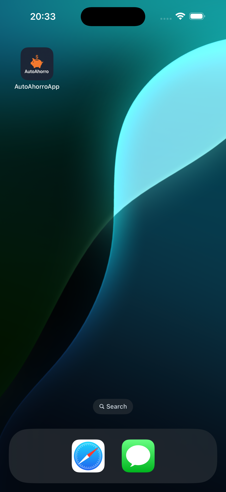
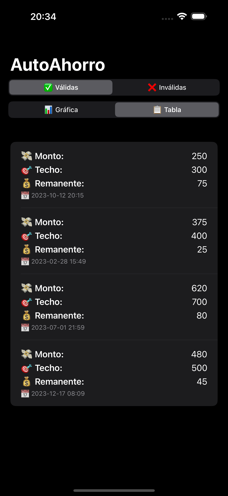

# 💰 AutoAhorro

Simulador de autoahorro que redondea gastos y calcula remanentes por transacción, tomando en cuenta restricciones temporales y evaluaciones configurables.

---

## 🚀 ¿Qué hace este proyecto?

`AutoAhorro` recibe una lista de transacciones simuladas (fecha y monto), y calcula para cada una:

- El **techo redondeado al múltiplo de 100 más cercano**.
- El **remanente** (diferencia entre techo y monto).
- Aplica **bonificaciones extra o restricciones fijas** según ventanas de tiempo.
- Genera un resultado en formato JSON con transacciones válidas e inválidas.
- 📱 Visualiza los datos en una mini app para iPhone construida con **SwiftUI**.
- 📊 Muestra gráficos interactivos con el framework **Charts** de Apple.

---

## 🧱 Estructura del proyecto

Sources/
├── Domain/
│   └── DomainModels.swift         // Modelos: Restriction, Transaction, Output, etc.
├── Input/
│   └── UserInput.swift            // [Por implementar] Entrada dinámica del usuario
├── IO/
│   └── JSONExporter.swift         // Exporta resultado como JSON legible
├── Logic/
│   └── TransactionProcessor.swift // Procesamiento, redondeo, formatter
└── AutoAhorro/
└── main.swift                     // Versión terminal que orquesta todo
AutoAhorroApp/
├── AutoAhorroApp.swift            // Punto de entrada SwiftUI
├── ContentView.swift              // Vista principal combinada
├── ChartView.swift                // Gráfico de barras
├── TableView.swift                // Lista con resultados detallados
├── OutputViewModel.swift          // ViewModel con transacciones simuladas
└── Assets.xcassets/               // Iconos y logo
CAPTURAS/
├── 1.1.png                        // Launch screen simulado
├── 1.2.png                        // Gráfica con barras de datos
├── 1.3.png                        // Lista de resultados
├── 1.4.png                        // Toggle de tabla o gráfica
├── 1.5.png                        // Interfaz minimalista alternativa

---

## 📲 Interfaz SwiftUI

La versión visual incluye:

- Un gráfico con barras para **Monto**, **Techo** y **Remanente**.
- Una lista clara y minimalista de las transacciones procesadas.
- Soporte para alternar entre tabla o gráfico (en desarrollo).
- Colores suaves y tipografía legible.

---

## 📸 Capturas de pantalla

Visualiza cómo luce en el simulador de iPhone:

| Launch | Gráfico | Lista | Selector | Modo tabla |
|--------|---------|-------|----------|------------|
|  |  |  |  |  |

---

## 🧪 ¿Cómo correrlo?

1. Abre el proyecto en **Xcode**.
2. Corre el esquema `AutoAhorroApp` en un simulador de iPhone.
3. Verás la visualización animada con transacciones precargadas.
4. Para salida JSON por consola, corre `main.swift`.

---

## 🧾 Ejemplo de salida JSON (modo consola)

```json
{
  "invalid": [],
  "valid": [
    {
      "amount": 250,
      "remanent": 75,
      "date": "2023-10-12 20:15",
      "ceiling": 300
    },
    {
      "amount": 375,
      "remanent": 25,
      "date": "2023-02-28 15:49",
      "ceiling": 400
    }
  ]
}

---

## 📲 Interfaz SwiftUI

La versión visual incluye:

- Un gráfico con barras para **Monto**, **Techo** y **Remanente**.
- Una lista clara y minimalista de las transacciones procesadas.
- Soporte para alternar entre tabla o gráfico (en desarrollo).
- Colores suaves y tipografía legible.

---

## 📸 Capturas de pantalla

Visualiza cómo luce en el simulador de iPhone:

| Launch | Gráfico | Lista | Selector | Modo tabla |
|--------|---------|-------|----------|------------|
|  |  |  |  |  |

---

## 🧪 ¿Cómo correrlo?

1. Abre el proyecto en **Xcode**.
2. Corre el esquema `AutoAhorroApp` en un simulador de iPhone.
3. Verás la visualización animada con transacciones precargadas.
4. Para salida JSON por consola, corre `main.swift`.

---

## 🧾 Ejemplo de salida JSON (modo consola)

```json
{
  "invalid": [],
  "valid": [
    {
      "amount": 250,
      "remanent": 75,
      "date": "2023-10-12 20:15",
      "ceiling": 300
    },
    {
      "amount": 375,
      "remanent": 25,
      "date": "2023-02-28 15:49",
      "ceiling": 400
    }
  ]
}

🧭 Roadmap

✅ v1.0 - Terminal + JSON Output
✅ v1.0 - SwiftUI App con Charts


👨‍💻 Autor:

Desarrollado por Sebastián Verástegui
🔗 https://sebsverastegui.com

---
